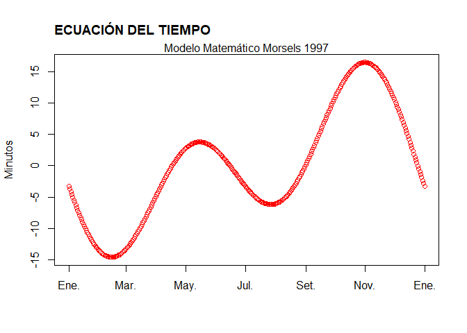

TAREA 2 FINAL
================
Kevin Huanca
18/12/2021

# DESARROLLO DE LA TAREA 2

## 1.¿Qué cantidad de dinero sobra al repartir 10000$ entre 3 personas?

``` r
1000%%3
```

    ## [1] 1

## 2.¿Es el número 4560 divisible por 3?

``` r
0 == 1000%%3
```

    ## [1] FALSE

## 3.Construya un vector con los numeros enteros del 2 al 87. ¿Cúales de esos numeros son divisibles por 7?

``` r
vector_1 <-seq(2,87)
vector_1[which(0 == vector_1%%7)]
```

    ##  [1]  7 14 21 28 35 42 49 56 63 70 77 84

## 4.Construya dos vectores, el primero con los numeros enteros desde 7 hasta 3, el segundo vector con los primeros cinco numeros positivos divisibles por 5

``` r
vector01 <-seq(7,3,-1)

vector02 <-seq(5,25,5)
```

## a. Sea A la condición de ser par en el primer vector.

``` r
A <-(0 == vector01%%2)
```

## b.Sea B la condición de ser mayor que 10 en el segundo vector.

``` r
B <-(vector02 > 10)
```

## c.¿En cual de las 5 posiciones se cumple A y B simultaneamente?

``` r
which(A == B)
```

    ## [1] 1 4

## 5.Consulte este link en el cual hay una anectoda de Gauss niño. Use R para obtener el resultado de la suma solicitada por el profesor del niño Gauss.

``` r
suma <-function(n1){
  cuerpo <-(n1*(n1+1)/2)
  return(cuerpo)
}
suma(100)
```

    ## [1] 5050

## 6. Construya un vector con los siguientes elementos: 1, -4, 5, 9, -4. Escriba un procedimiento para extraer las posiciones donde esta el valor minimo en el vector.

``` r
C <-c(1,-4,5,9,-4)

which(C == min(C))
```

    ## [1] 2 5

## 7.Calcular 8!

``` r
factorial(8)
```

    ## [1] 40320

## 8.CAlcular la siguiente sumatoria.

``` r
k <-c(3,4,5,6,7)
sum(exp(k))
```

    ## [1] 1723.159

## 9.Evaluar la siguiente productoria.

``` r
j <-seq(1,10)
prod(log(sqrt(j)))
```

    ## [1] 0

## 10.Calcular el area sombreada del sector circular

``` r
Area <-function(x,r){
  cuerpo <-(r^2/2)*(x - sin(x))
  return(cuerpo)
}
Area(2,1*pi)
```

    ## [1] 5.382401

## 11.Construya un vector cualquiera e inviertalo, es decir, que el primer elemento quede dé ultimo, el segundo de pen ultimo y asi sucesivamente. Compare su resultado con el de la funcion rev

``` r
V <-seq(1:10)
rev(V)
```

    ##  [1] 10  9  8  7  6  5  4  3  2  1

## 12.Calculator la siguiente sumatoria

``` r
A12 <-seq(10,100)
suma <-function(x){
  cuerpo <-(x^3 + 4*(x^2))
return(cuerpo)
}
sum(suma(A12))
```

    ## [1] 26852735

## 13. Calcular la siguiente sumatoria

``` r
A13 <-seq(1,25)
suma2 <-function(x){
  cuerpo <-((2^x/x) + (3^x/x2))
  return(cuerpo)
}
sum(suma(A13))
```

    ## [1] 127725

## 14.

``` r
Data_14 <-read.table("https://raw.githubusercontent.com/fhernanb/datos/master/Paises.txt",header = TRUE)
Data_14
```

    ##                 Pais poblacion alfabetizacion tasamortinf   PIB
    ## 1         Acerbaján_      7400             98        35.0  3000
    ## 2         Afganistán     20500             29       168.0   205
    ## 3           Alemania     81200             99         6.5 17539
    ## 4       Arabia_Saudí     18000             62        52.0  6651
    ## 5         Argentina_     33900             95        25.6  3408
    ## 6           Armenia_      3700             98        27.0  5000
    ## 7         Australia_     17800            100         7.3 16848
    ## 8           Austria_      8000             99         6.7 18396
    ## 9           Bahrein_       600             77        25.0  7875
    ## 10        Bangladesh    125000             35       106.0   202
    ## 11          Barbados       256             99        20.3  6950
    ## 12          Bélgica_     10100             99         7.2 17912
    ## 13        Bielorusia     10300             99        19.0  6500
    ## 14          Bolivia_      7900             78        75.0   730
    ## 15            Bosnia      4600             86        12.7  3098
    ## 16          Botswana      1359             72        39.3  2677
    ## 17            Brasil    156600             81        66.0  2354
    ## 18          Bulgaria      8900             93        12.0  3831
    ## 19      Burkina_Faso     10000             18       118.0   357
    ## 20          Burundi_      6000             50       105.0   208
    ## 21          Camboya_     10000             35       112.0   260
    ## 22          Camerún_     13100             54        77.0   993
    ## 23            Canadá     29100             97         6.8 19904
    ## 24            Chile_     14000             93        14.6  2591
    ## 25            China_   1205200             78        52.0   377
    ## 26          Colombia     35600             87        28.0  1538
    ## 27  Corea_del_Norte_     23100             99        27.7  1000
    ## 28    Corea_del_Sur_     45000             96        21.7  6627
    ## 29        Costa_Rica      3300             93        11.0  2031
    ## 30          Croacia_      4900             97         8.7  5487
    ## 31              Cuba     11100             94        10.2  1382
    ## 32        Dinamarca_      5200             99         6.6 18277
    ## 33          Ecuador_     10700             88        39.0  1085
    ## 34            Egipto     60000             48        76.4   748
    ## 35      El_Salvador_      5800             73        41.0  1078
    ## 36  Emiratos_Árabes_      2800             68        22.0 14193
    ## 37            España     39200             95         6.9 13047
    ## 38    Estados_Unidos    260800             97         8.1 23474
    ## 39          Estonia_      1600             99        19.0  6000
    ## 40          Etiopía_     55200             24       110.0   122
    ## 41        Filipinas_     69800             90        51.0   867
    ## 42        Finlandia_      5100            100         5.3 15877
    ## 43          Francia_     58000             99         6.7 18944
    ## 44            Gabón_      1300             61        94.0  4283
    ## 45            Gambia       959             27       124.0   351
    ## 46          Georgia_      5500             99        23.0  4500
    ## 47      Gran_Bretaña     58400             99         7.2 15974
    ## 48            Grecia     10400             93         8.2  8060
    ## 49        Guatemala_     10300             55        57.0  1342
    ## 50            Haití_      6500             53       109.0   383
    ## 51          Honduras      5600             73        45.0  1030
    ## 52        Hong_Kong_      5800             77         5.8 14641
    ## 53            Hungía     10500             99        12.5  5249
    ## 54            India_    911600             52        79.0   275
    ## 55        Indonesia_    199700             77        68.0   681
    ## 56              Irán     65600             54        60.0  1500
    ## 57              Iraq     19900             60        67.0  1955
    ## 58          Irlanda_      3600             98         7.4 12170
    ## 59          Islandia       263            100         4.0 17241
    ## 60            Israel      5400             92         8.6 13066
    ## 61            Italia     58100             97         7.6 17500
    ## 62            Japón_    125500             99         4.4 19860
    ## 63          Jordania      3961             80        34.0  1157
    ## 64            Kenia_     28200             69        74.0   323
    ## 65            Kuwait      1800             73        12.5  6818
    ## 66          Letonia_      2700             99        21.5  7400
    ## 67            Líbano      3620             80        39.5  1429
    ## 68          Liberia_      2900             40       113.0   409
    ## 69            Libia_      5500             64        63.0  5910
    ## 70          Lituania      3800             99        17.0  6710
    ## 71          Malasia_     19500             78        25.6  2995
    ## 72        Marruecos_     28600             50        50.0  1062
    ## 73            México     91800             87        35.0  3604
    ## 74        Nicaragua_      4100             57        52.5   447
    ## 75          Nigeria_     98100             51        75.0   282
    ## 76          Noruega_      4300             99         6.3 17755
    ## 77    Nueva_Zelanda_      3524             99         8.9 14381
    ## 78      Países_Bajos     15400             99         6.3 17245
    ## 79          Pakistán    128100             35       101.0   406
    ## 80            Panamá      2600             88        16.5  2397
    ## 81          Paraguay      5200             90        25.2  1500
    ## 82              Perú     23650             85        54.0  1107
    ## 83          Polonia_     38600             99        13.8  4429
    ## 84          Portugal     10500             85         9.2  9000
    ## 85  Rep._C._Africana      3300             27       137.0   457
    ## 86  Rep._Dominicana_      7800             83        51.5  1034
    ## 87            Ruanda      8400             50       117.0   292
    ## 88          Rumanía_     23400             96        20.3  2702
    ## 89            Rusia_    149200             99        27.0  6680
    ## 90          Senegal_      8700             38        76.0   744
    ## 91          Singapur      2900             88         5.7 14990
    ## 92            Siria_     14900             64        43.0  2436
    ## 93          Somalia_      6667             24       126.0  2126
    ## 94        Sudáfrica_     43900             76        47.1  3128
    ## 95            Suecia      8800             99         5.7 16900
    ## 96            Suiza_      7000             99         6.2 22384
    ## 97        Tailandia_     59400             93        37.0  1800
    ## 98            Taiwan     20944             91         5.1  7055
    ## 99          Tanzania     29800             46       110.0   263
    ## 100         Turquía_     62200             81        49.0  3721
    ## 101         Ucrania_     51800             97        20.7  2340
    ## 102           Uganda     19800             48       112.0   325
    ## 103         Uruguay_      3200             96        17.0  3131
    ## 104       Uzbekistán     22600             97        53.0  1350
    ## 105       Venezuela_     20600             88        28.0  2829
    ## 106         Vietnam_     73100             88        46.0   230
    ## 107           Zambia      9100             73        85.0   573

## a.Calcular el numero de varibales del dataset

``` r
ncol(Data_14)
```

    ## [1] 5

## b.Cuantos paises hay en el dataset

``` r
length(Data_14)
```

    ## [1] 5

## c.Cual es el pais con mayor poblacion

``` r
Data_14[(Data_14$poblacion == max(Data_14$poblacion)),]$Pais
```

    ## [1] "China_"

## d.Cual es el pais con alfabetización mas baja

``` r
Data_14[(Data_14$alfabetizacion == min(Data_14$alfabetizacion)),]$Pais
```

    ## [1] "Burkina_Faso"

## 15.De la base de datos mtcars

``` r
View(mtcars)
```

## a.Autos que tengan un redimiento menor a 18 millas por galon

``` r
rownames(mtcars[(mtcars$mpg < 18),])
```

    ##  [1] "Duster 360"          "Merc 280C"           "Merc 450SE"         
    ##  [4] "Merc 450SL"          "Merc 450SLC"         "Cadillac Fleetwood" 
    ##  [7] "Lincoln Continental" "Chrysler Imperial"   "Dodge Challenger"   
    ## [10] "AMC Javelin"         "Camaro Z28"          "Ford Pantera L"     
    ## [13] "Maserati Bora"

## b.Autos que tengan 4 cilindros

``` r
rownames(mtcars[(mtcars$cyl == 4),])
```

    ##  [1] "Datsun 710"     "Merc 240D"      "Merc 230"       "Fiat 128"      
    ##  [5] "Honda Civic"    "Toyota Corolla" "Toyota Corona"  "Fiat X1-9"     
    ##  [9] "Porsche 914-2"  "Lotus Europa"   "Volvo 142E"

## c.Autos que pesan mas de 2500 libras y tienen transmicion automatica

``` r
rownames(mtcars[(mtcars$wt > 2.500 & mtcars$am == 1),])
```

    ## [1] "Mazda RX4"      "Mazda RX4 Wag"  "Ford Pantera L" "Ferrari Dino"  
    ## [5] "Maserati Bora"  "Volvo 142E"

## 16. Replicar la grafica de la fucion del tiempo

``` r
X <-c(0:365)
Y <-(2*pi)*(X - 81)/365
Funcion <-function(Y){
  cuerpo <-(9.87*sin(2*Y) - 7.53*cos(Y) - 1.5*sin(Y))
  return(cuerpo)
  }
Funcion(Y)
```

    ##   [1]  -3.25623492  -3.70517832  -4.14971009  -4.58942083  -5.02390687
    ##   [6]  -5.45277062  -5.87562111  -6.29207431  -6.70175363  -7.10429032
    ##  [11]  -7.49932382  -7.88650223  -8.26548264  -8.63593149  -8.99752500
    ##  [16]  -9.34994945  -9.69290154 -10.02608875 -10.34922958 -10.66205393
    ##  [21] -10.96430334 -11.25573125 -11.53610331 -11.80519758 -12.06280479
    ##  [26] -12.30872852 -12.54278545 -12.76480551 -12.97463203 -13.17212197
    ##  [31] -13.35714598 -13.52958854 -13.68934812 -13.83633719 -13.97048235
    ##  [36] -14.09172437 -14.20001822 -14.29533312 -14.37765251 -14.44697408
    ##  [41] -14.50330972 -14.54668549 -14.57714155 -14.59473209 -14.59952526
    ##  [46] -14.59160302 -14.57106105 -14.53800860 -14.49256835 -14.43487621
    ##  [51] -14.36508116 -14.28334504 -14.18984234 -14.08475995 -13.96829696
    ##  [56] -13.84066434 -13.70208473 -13.55279212 -13.39303156 -13.22305883
    ##  [61] -13.04314016 -12.85355186 -12.65458000 -12.44652001 -12.22967636
    ##  [66] -12.00436216 -11.77089877 -11.52961542 -11.28084876 -11.02494251
    ##  [71] -10.76224699 -10.49311871 -10.21791993  -9.93701822  -9.65078601
    ##  [76]  -9.35960014  -9.06384139  -8.76389404  -8.46014538  -8.15298526
    ##  [81]  -7.84280562  -7.53000000  -7.21496308  -6.89809019  -6.57977687
    ##  [86]  -6.26041836  -5.94040912  -5.62014241  -5.30000975  -4.98040051
    ##  [91]  -4.66170142  -4.34429610  -4.02856464  -3.71488310  -3.40362310
    ##  [96]  -3.09515137  -2.78982930  -2.48801254  -2.19005058  -1.89628628
    ## [101]  -1.60705557  -1.32268694  -1.04350116  -0.76981083  -0.50192005
    ## [106]  -0.24012406   0.01529112   0.26404898   0.50588290   0.74053639
    ## [111]   0.96776347   1.18732884   1.39900826   1.60258874   1.79786880
    ## [116]   1.98465868   2.16278058   2.33206885   2.49237016   2.64354366
    ## [121]   2.78546119   2.91800733   3.04107959   3.15458848   3.25845762
    ## [126]   3.35262379   3.43703703   3.51166061   3.57647112   3.63145846
    ## [131]   3.67662582   3.71198966   3.73757968   3.75343874   3.75962283
    ## [136]   3.75620094   3.74325496   3.72087959   3.68918219   3.64828260
    ## [141]   3.59831302   3.53941778   3.47175321   3.39548734   3.31079977
    ## [146]   3.21788135   3.11693399   3.00817033   2.89181353   2.76809692
    ## [151]   2.63726373   2.49956676   2.35526804   2.20463852   2.04795770
    ## [156]   1.88551325   1.71760069   1.54452296   1.36659005   1.18411861
    ## [161]   0.99743152   0.80685750   0.61273068   0.41539016   0.21517960
    ## [166]   0.01244675  -0.19245697  -0.39917692  -0.60735571  -0.81663367
    ## [171]  -1.02664924  -1.23703953  -1.44744069  -1.65748846  -1.86681857
    ## [176]  -2.07506724  -2.28187163  -2.48687031  -2.68970374  -2.89001470
    ## [181]  -3.08744877  -3.28165476  -3.47228520  -3.65899676  -3.84145069
    ## [186]  -4.01931326  -4.19225620  -4.35995711  -4.52209990  -4.67837517
    ## [191]  -4.82848063  -4.97212147  -5.10901079  -5.23886993  -5.36142885
    ## [196]  -5.47642649  -5.58361111  -5.68274062  -5.77358290  -5.85591612
    ## [201]  -5.92952902  -5.99422122  -6.04980344  -6.09609782  -6.13293812
    ## [206]  -6.16016999  -6.17765113  -6.18525154  -6.18285369  -6.17035268
    ## [211]  -6.14765641  -6.11468572  -6.07137451  -6.01766987  -5.95353212
    ## [216]  -5.87893496  -5.79386546  -5.69832418  -5.59232513  -5.47589582
    ## [221]  -5.34907724  -5.21192387  -5.06450361  -4.90689773  -4.73920084
    ## [226]  -4.56152074  -4.37397838  -4.17670773  -3.96985560  -3.75358155
    ## [231]  -3.52805772  -3.29346861  -3.05001091  -2.79789332  -2.53733626
    ## [236]  -2.26857172  -1.99184290  -1.70740406  -1.41552013  -1.11646652
    ## [241]  -0.81052872  -0.49800206  -0.17919134   0.14558952   0.47601781
    ## [246]   0.81176239   1.15248410   1.49783610   1.84746429   2.20100772
    ## [251]   2.55809897   2.91836462   3.28142562   3.64689778   4.01439215
    ## [256]   4.38351555   4.75387093   5.12505791   5.49667318   5.86831103
    ## [261]   6.23956376   6.61002217   6.97927609   7.34691476   7.71252740
    ## [266]   8.07570364   8.43603400   8.79311039   9.14652659   9.49587869
    ## [271]   9.84076559  10.18078951  10.51555636  10.84467631  11.16776419
    ## [276]  11.48443993  11.79432908  12.09706319  12.39228026  12.67962520
    ## [281]  12.95875021  13.22931523  13.49098832  13.74344607  13.98637400
    ## [286]  14.21946689  14.44242921  14.65497542  14.85683037  15.04772957
    ## [291]  15.22741956  15.39565820  15.55221497  15.69687124  15.82942057
    ## [296]  15.94966891  16.05743491  16.15255008  16.23485907  16.30421979
    ## [301]  16.36050366  16.40359574  16.43339488  16.44981387  16.45277955
    ## [306]  16.44223292  16.41812920  16.38043796  16.32914309  16.26424290
    ## [311]  16.18575014  16.09369195  15.98810992  15.86905999  15.73661245
    ## [316]  15.59085188  15.43187705  15.25980081  15.07475004  14.87686544
    ## [321]  14.66630145  14.44322608  14.20782072  13.96027993  13.70081130
    ## [326]  13.42963515  13.14698436  12.85310408  12.54825148  12.23269548
    ## [331]  11.90671645  11.57060589  11.22466614  10.86921005  10.50456060
    ## [336]  10.13105060   9.74902228   9.35882693   8.96082453   8.55538334
    ## [341]   8.14287947   7.72369652   7.29822511   6.86686245   6.43001194
    ## [346]   5.98808268   5.54148906   5.09065025   4.63598977   4.17793503
    ## [351]   3.71691683   3.25336888   2.78772735   2.32043036   1.85191752
    ## [356]   1.38262941   0.91300710   0.44349169  -0.02547620  -0.49345694
    ## [361]  -0.96001233  -1.42470612  -1.88710446  -2.34677644  -2.80329450
    ## [366]  -3.25623492

``` r
YRS <-seq(as.Date("2021-01-01"), as.Date("2022-01-01"), "day")

plot(YRS, Funcion(Y), ylab = "Minutos", xlab = "", col ="red", lwd = 0.1, lty = 3, axes = TRUE)
mtext("Modelo Matemático Morsels 1997", side = 3)
title("ECUACIÓN DEL TIEMPO", adj= 0.00001, line = 1.5)
```

<!-- -->
